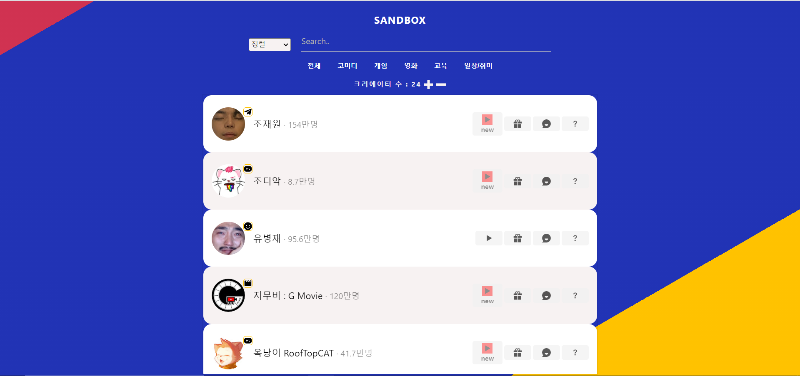

# SB(Sand Box)

### 샌드박스

---

## Version별 <a href="https://hidden-earth-27978.herokuapp.com/">영상확인</a>

> ### 목표

댓글은 다양한 정보들을 내포하고 있고 크리에이터와 시청자의 소통 창구로써 중요한 역할을 하고 있습니다. 크리에이터의 규모가 커질수록 댓글의 수 또한 증가하게 되었고 크리에이터가 대부분의 댓글 내용을 확인한다는 것은 실현하기 어려운 문제가 되었습니다. 크리에이터가 최대한 여러 시청자들의 의견을 접할 수 있도록 기능을 구현하고 시청자들이 크리에이터들(샌드박스 소속)의 활동을 조금 더 직관적으로 확인할 수 있도록 서비스를 구현하는 것이 목표입니다.
이 서비스를 이용하는 사용자(크리에이터)는 효율적인 시청자 관리와 시청자들과 다방면으로 소통을 할 수 있게 됨으로써 질적으로 나은 콘텐츠 제작이 가능할 것으로 예상됩니다.
또한 이 서비스를 이용하는 사용자(시청자)는 다양한 볼거리를 제공받을 수 있으며 영상 시청 중 궁금한 점이 있을 경우 빠른 댓글 검색을 통해 자신이 원하는 정보에 접근할 수 있어 궁금증 해결에 도움이 될 것으로 예상됩니다.

 

> ### Stack

- Backend : express mongo
- Frontend : ReactJS

 

> ### 기능

Ver.1(웹 버전)

- 새로운 영상이 있을 시 시각적인 효과를 제공
- 댓글 검색 기능을 추가하여 원하는 댓글 또는 다양한 의견에 접근 가능하도록 구현
  (ex 어떠한 동영상을 시청하는 도중 4:46에 궁금한 점이 생겼는데 관련해서 언급했던 댓글이 있는지 검색)
- 댓글 이벤트 시 편의성 제공: 사용자(크리에이터)가 설정한 인원수만큼 자동으로 당첨자를 추출하도록 구현

Ver.2(예상)

- 앱 버전 제작
- (샌드박스 소속) 크리에이터 추가 기능 (제작 완료)
- 채널 제거 기능 (제작 완료)
- API를 매일 정해진 호출 시간에 한 번만 호출하고, 응답받은 정보들을 데이터 베이스에 저장(API 할당량을 효과적으로 줄일 수 있을 듯)
- 댓글 작성, 동영상 업로드 기능 구현
- 회원가입 기능을 추가하여 개인이 원하는 관심 동영상, 관심 채널 등 등록 가능하게 구현

Ver.1 제작 후 AWS 배포하여 자체적으로 사용해보고 유지 보수하며 Ver.2제작 후 사람들에게 정식 배포 예정

보류
- 중복 댓글 요약(자주 언급되는 댓글의 내용을 분석)
- 동영상 녹화 기능 구현
- 실시간 경매 시스템
- 팬카페
- 음성 인식으로 댓글 입력이 가능하도록(https://youtu.be/I4MCNvQc7RU)

 

> ### Commit rule

- 날짜 | 상태 | 기능
  - ex) 200612 | DONE | 로그 출력 기능 추가
  - ex) 200612 | ING | Login
  - ex) 200612 | ERROR | Password 구현 오류 (500 에러)
  - ex) 200612 | DONE | Password 구현 완료

 

> ### 필요한 것

 

> ### 한계 또는 주의사항

- youtube API 할당량은 하루 10000으로 불 필요한 API 호출을 줄여야 함
- 개수 제한이 있음(ex 댓글은 최대 100개만 가져올 수 있음, 채널 리스트 최대 50개만 요청 가능)
   

> ### Member

- 문성우
